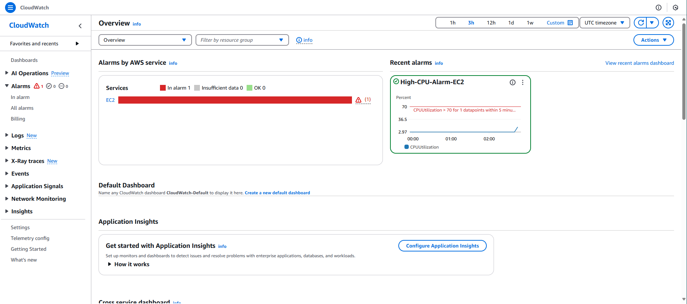
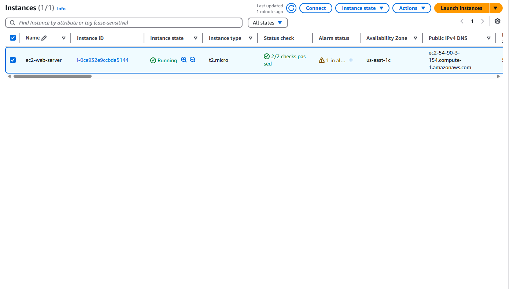
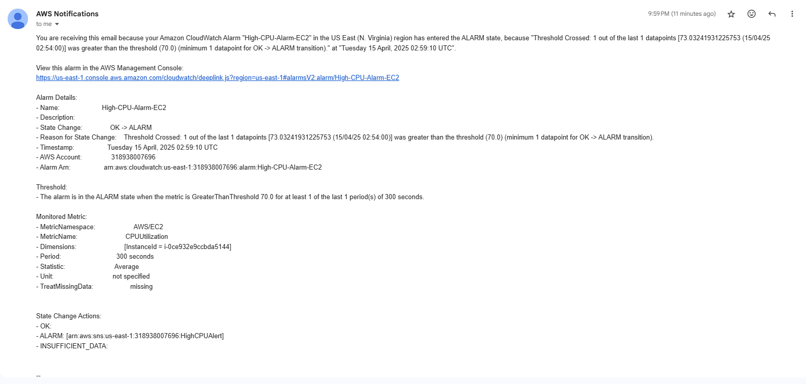
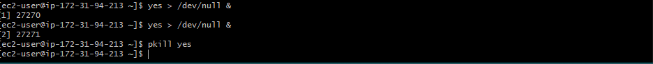

# CloudWatch CPU Alarm Project (4/14/25)

This project demonstrates how to monitor EC2 CPU usage and trigger email alerts using CloudWatch and SNS.

## AWS Services Used

- EC2
- CloudWatch (for monitoring)
- SNS (for notifications)

## Steps Taken

1. Launched an EC2 instance (t2.micro)
2. Created an SNS topic and email subscription
3. Created a CloudWatch alarm for CPUUtilization > 70%
4. Simulated CPU load using `yes > /dev/null &`
5. Received alert via email when alarm was triggered

## Screenshots

### Alarm Triggered

### EC2 Instance

### Email Alert

### CPU Load Test in SSH

## What I Learned

- How to set up proactive monitoring
- Using native tools for real-time alerts
- How to simulate stress testing in a cloud environment

